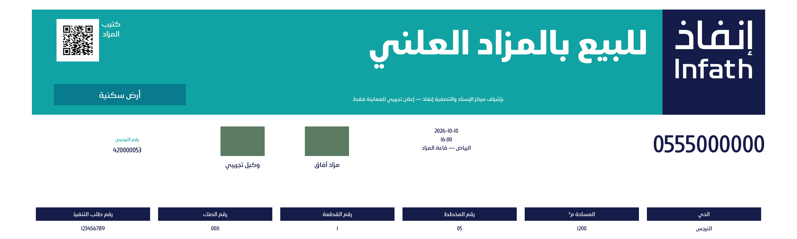
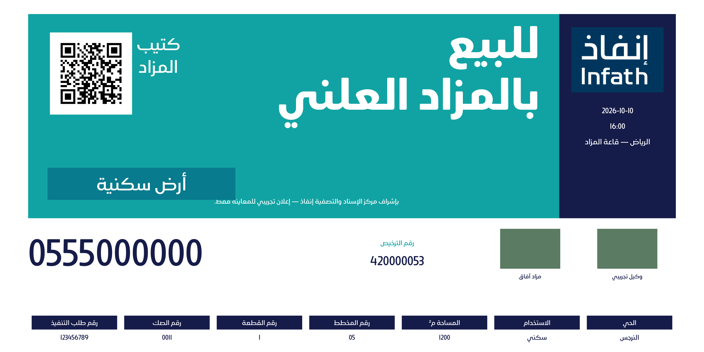
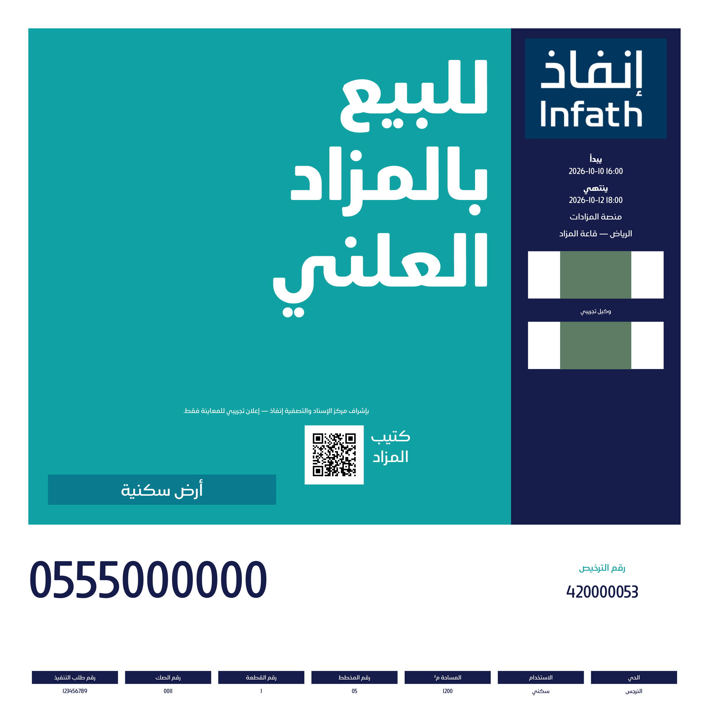

# قسم البنرات ضمن المشروع

المسار الافتراضي: **إنشاء مشروع ← بيانات المشروع ← البنرات ← التصميم ← المراجعة والتوليد**. تُستخدم العقارات والصور ووكيل البيع وبيانات المزاد المحفوظة نفسها دون إعادة إدخال. من القائمة الجانبية «البنرات» يمكنك اختيار مشروع موجود، أو اختيار «إنشاء حملة بنرات مستقلة» صراحةً.

في المشروع المشترك تظهر خطوات التصميم والمراجعة والمخرجات فقط؛ روابط النواقص تعيدك إلى بيانات المشروع. الخطوات التفصيلية أدناه تصف ما تحتاجه البيانات، وتظل كاملة للحملة المستقلة.

## المسار

1. اختر التصميم والمقاس، وشاهد صورة المرجع. يمكن تخصيص العقارات المشمولة؛ ترك الاختيار فارغًا يعني جميع عقارات الحملة.
2. أدخل اسم المزاد والترخيص والتواصل والإعلان النظامي ورابط الكتيّب. اختر حضوريًا أو إلكترونيًا أو هجينًا وأكمل المواعيد والموقع أو المنصة.
3. أضف العقارات يدويًا أو من قالب Excel المعتمد. أكمل الحي والمساحة والصك والمخطط والقطعة وطلب التنفيذ والاستخدام. رقم طلب التنفيذ ليس ضمن قالب Excel، لذا يُستكمل في نموذج العقار.
4. احفظ بيانات وكيل البيع وشعاره، وارفع شعار المزاد ضمن صور الحملة بتصنيف «شعار المزاد».
5. راجع النواقص. التوليد محجوب حتى اكتمال البيانات؛ النصوص الأطول من مساحة القالب تعرض حدًا واضحًا للاختصار.
6. راجع البنرات ثم اعتمدها لتنزيل PDF وصورة PNG لكل عقار. تغيير البيانات يبطل الاعتماد إلى حين إعادة التوليد والمراجعة. إعادة توليد نسخة سبق اعتمادها تُنشئ مسودة جديدة.

## القوالب والتصدير

| التصميم | المقاسات النهائية |
| --- | --- |
| بانورامي | 10×3 م، 15×5 م |
| أفقي | 4×2 م، 6×3 م، 10×5 م |
| مربع | 2×2 م |

ملف PDF بمقياس **1:10**: يُطبع عند **1000٪** للوصول إلى المقاس النهائي. مثال 4×2 م ينتج PDF بقياس 400×200 مم. النصوص والرموز تبقى داخل PDF؛ جودة الشعارات تعتمد على الصور المرفوعة. صور PNG للمعاينة بعرض 2400 بكسل. كل عقار صفحة مستقلة وصورة مستقلة. QR يشفّر رابط الكتيّب الذي أدخله المستخدم، ولا يُنشأ رابط وهمي.

## المراجع والصور

التصميم مبني على «دليل التسويق والهوية البصرية للمزادات V2»، الصفحات 28–33، وعلى «قوالب حضوري مفتوح» ذي الأمثلة الستة. يُستخدم خط Ruaq وشعار إنفاذ المرفقان في مصدر المشروع. صور صفحات المرجع في `frontend/public/banner-references/`، والقالب القابل لتعبئة البيانات في `backend/app/templates/infath/board.html`.

أمثلة فعلية مولّدة بواسطة اختبارات النظام أدناه. جميع البيانات تجريبية، والمربعات الملونة بدائل لشعاري المزاد والوكيل في الاختبار، وليست شعارات عملاء.

### بانورامي 10×3 م

### أفقي 4×2 م

### مربع 2×2 م — هجين

## التنفيذ والتحقق

- الترحيل `0004` يضيف `workspace_type` و`banner_config`، ويجعل النوع الافتراضي للسجلات السابقة `booklet` دون تحويل بياناتها.
- `GET /api/banner-templates` يعرض المقاسات؛ `PUT /api/projects/{id}/banner-config` يحفظ المقاس والعقارات المسموحة؛ `GET /api/projects/{id}/banner-review` يعيد النواقص مع القسم والحد الأقصى للنص عند الحاجة.
- خدمات الإدخال والصور والملكية مشتركة، لكن حملات البنرات لا تولّد كتيّبات أو مخرجات أخرى. مولّد البنرات التاريخي يبقى متاحًا عبر واجهته البرمجية لتوافق السجلات السابقة، ويُحذف خيار إنشاء بنرات جديدة من واجهة الكتيّبات.
- `backend/tests/test_banners.py`: المقاسات الستة وأبعاد PDF، QR قابل للقراءة، الموافقة والتنزيل، حفظ النسخ المعتمدة، اختيار العقارات ومنع الاختيارات غير المملوكة والنواقص، الفصل عن إحصاءات الكتيّبات.
- `frontend/e2e/banners.spec.ts`: المسار الكامل من القائمة إلى التنزيل، وفصل القائمتين والعربية وشاشة الهاتف.
