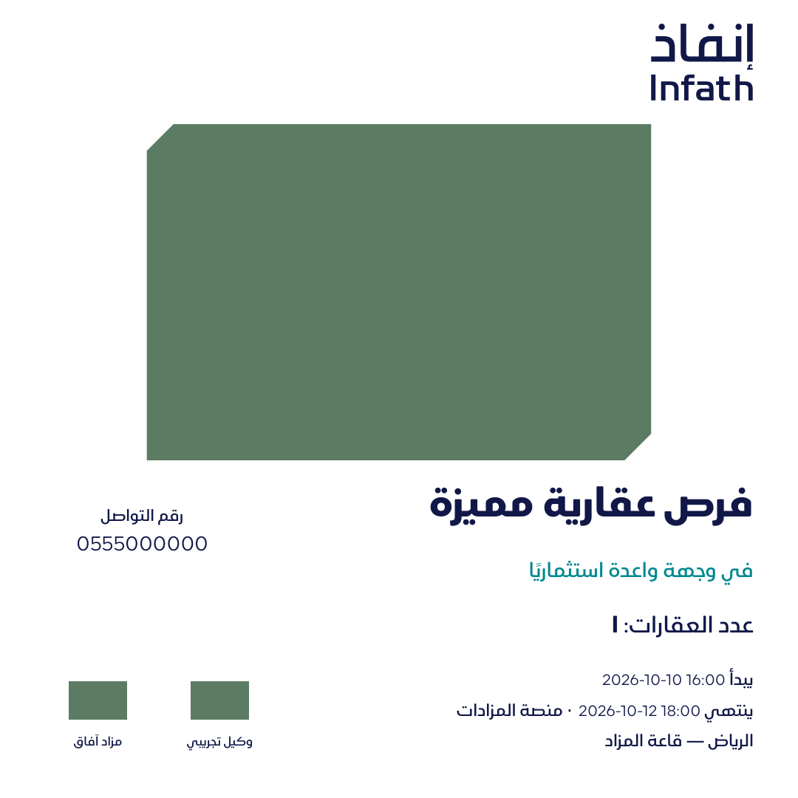
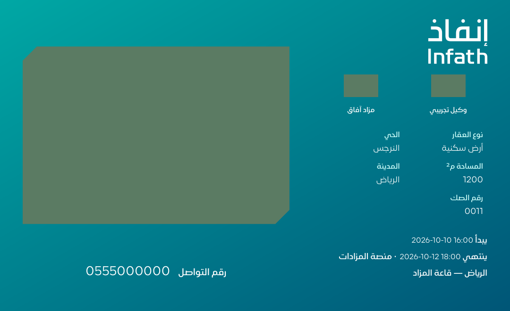

# منشورات التواصل وفحص الأقسام الثلاثة

## القسم الثالث

المشروع هو المصدر المشترك لبيانات المزاد والعقارات والصور ووكيل البيع. داخله أقسام الكتيّب والبنرات ومنشورات التواصل، مع إعدادات التصميم والمخرجات الخاصة بكل نوع وقائمة تجمع جميع المخرجات. لا تُنسخ البيانات ولا يُنشأ مشروع إضافي عند الانتقال بين الأقسام. إنشاء حملة مستقلة خيار صريح إضافي.

المسار الافتراضي: **إنشاء مشروع ← بيانات المشروع مرة واحدة ← منشورات التواصل ← المنصة والتصميم ← المراجعة والتوليد ← الاعتماد والتنزيل**. صفحة منشورات التواصل تتيح اختيار مشروع موجود أو إنشاء حملة مستقلة.

| القالب | المقاس النهائي للصورة | الأنواع | الألوان | المرجع |
| --- | --- | --- | --- | --- |
| X أفقي | 1080 × 660 px | إعلان مزاد، منشور عقار | أبيض، تدرّج فيروزي | دليل إنفاذ V2، ص35 |
| إنستغرام مربع | 1080 × 1080 px | إعلان مزاد، منشور عقار | أبيض، تدرّج فيروزي | ص36 |
| سناب طولي | 1080 × 1920 px | إعلان مزاد | أبيض، فيروزي، كحلي | ص37 |

الدليل يحدد شكل ونسب القوالب، ولا ينص على هذه الأبعاد الرقمية بالبكسل. وافق صاحب المشروع على اعتمادها كتحديد تقني للتصدير. نسبة X هي 18:11 موافقة تقريبًا لنسبة المثال الأفقي. لا توصف دقة التصدير بأنها قياس حكومي منصوص عليه.

هذه الميزة تنتج منشورات صور ثابتة؛ فلاتر المؤثرين والفيديو والبريد الإلكتروني الموضحة في صفحات أخرى من الدليل ليست قوالب منشورات متاحة في هذا القسم.

## البيانات المطلوبة والمحتوى

- الاسم، العنوان التسويقي، الترخيص، رقم التواصل، والإعلان النظامي. يبقى النص النظامي كما أدخله المستخدم دون كتابة قانونية آلية أو AI.
- المزاد الحضوري: التاريخ ووقت البداية والموقع. الإلكتروني: تاريخ ووقت البداية والنهاية واسم المنصة. الهجين: بيانات الإلكتروني والموقع الحضوري.
- شعار المزاد وشعار وكيل البيع واسمه. إنفاذ مستخرج كمسارات متجهة أصلية من صفحة 6، مع نسخة كحلية وأخرى بيضاء؛ ملف التوثيق `infath-vector-provenance.json`. لا يعاد رسم الشعار أو تمديده. ارتفاع مواضع الشعارات المصاحبة في المنشورات نصف موضع إنفاذ وفق علاقة 2:1 في الدليل.
- إعلان المزاد: صورة عامة مرفوعة بتصنيف `cover` وعدد العقارات المختارة الفعلي.
- منشور العقار: النوع والمدينة والحي والمساحة الموجبة والصك وصورة `main` مرتبطة بالعقار نفسه. لا تؤخذ صورة من عقار أو حملة أخرى.
- الصورة تحافظ على نسبة أبعادها، وتُعرض داخل نافذة بزاويتين مائلتين. لا يُمدّد المحتوى لملء الفراغات؛ المعاينة ضرورية للتأكد من الزوايا وتفاصيل الصورة.
- اختيار العقارات محصور في الحملة، بحد أقصى 30 عقارًا. الاختيار الفارغ يعني جميع عقارات الحملة. لا تُستخدم أعداد أو بيانات المثال المرجعي.

التصدير: **PNG لكل منشور بالحجم المحدد تمامًا، TXT للنص المرافق، وPDF مجمّع للمراجعة**. يتضمن النص المرافق الإعلان النظامي والترخيص والمواعيد الخاصة بنوع المزاد وبيانات التواصل. لا يُنشر محتوى تلقائيًا على أي منصة.

## الفحص المشترك

قبل حفظ الملفات أو اعتمادها يفحص `generation/preflight.py`:

1. أبعاد PDF: الكتيّب A4 ‏210×297 مم؛ البنرات بأبعاد المقاس المختار عند 1:10؛ المنشورات بوحدات CSS px المحوّلة إلى PDF ثم إلى PNG بدقة 96dpi.
2. عدد صفحات البنرات والمنشورات مقابل العقارات/نوع المنشور.
3. حدود النص داخل الصفحة، وحدود الحقول ذات المساحات الثابتة: عناوين وأحكام البنرات، عنوان غلاف الكتيّب، وحقول منشورات التواصل.
4. عند التجاوز يعيد API خطأ `LAYOUT_PREFLIGHT_FAILED` وتتراجع المعاملة، فلا تُنشأ نسخة ناقصة قابلة للاعتماد.

يسجل الناتج تقرير `preflight` مع المقاس وعدد الصفحات وإصدار الفحص. تبقى مراجعة النصوص والهوية والصور من المستخدم قبل الاعتماد؛ الفحص التقني لا يصادق على صحة الوقائع أو التفويض النظامي ولا يغني عن المراجعة البصرية. تعديل البيانات المشتركة يلغي صلاحية اعتماد المخرجات التابعة للمشروع، بينما تعديل إعدادات تصميم نوع واحد يبطل ذلك النوع فقط، وإعادة التوليد بعد اعتماد سابق تنشئ نسخة جديدة وتحفظ الملف القديم.

حُسّن شعار إنفاذ المستخدم في البنرات وتذييل الكتيّب إلى نسخة متجهة بلا خلفية نقطية، وضُبطت مساحة نص البنرات. تُطبق الفحوص على التوليد الجديد وإعادة التوليد والاعتماد، دون مسح الملفات التاريخية.

## أمثلة ومصدر التنفيذ

صور المرجع الأصلية للواجهة: `frontend/public/social-references/`.

أمثلة اختبار فعلية ببيانات تجريبية وصور/شعارات مصمتة، وليست إعلانات حقيقية:

- البيانات: `social_schemas.py` و`services/social.py`؛ قاعدة البيانات: الترحيل `0005` يحافظ على نوع وبيانات الكتيّبات والبنرات السابقة.
- القالب: `templates/infath/social.html`؛ نافذة الصورة المتجهة: `generation/social_art.py`.
- الواجهة: `BannerWorkspace.tsx` يعيد استخدام خطوات الحملة حسب النوع، و`SocialTemplateFields.tsx` لإعدادات المنشورات. البيانات والمخرجات والقوائم مستقلة.
- الاختبارات: `test_social.py` يغطي التصاميم الـ11 مع الأنواع الثلاثة، الإنجليزية، الأبعاد الفعلية، النص النظامي، اختيار الصور والعقارات، خطأ تجاوز المساحة، الاعتماد وحفظ النسخ. `test_preflight.py` يختبر رفض المقاس الخاطئ وقص النص. `e2e/social.spec.ts` يغطي الاستخدام والتنزيل الفعلي للأبعاد وفصل الأقسام والعربية والهاتف.
